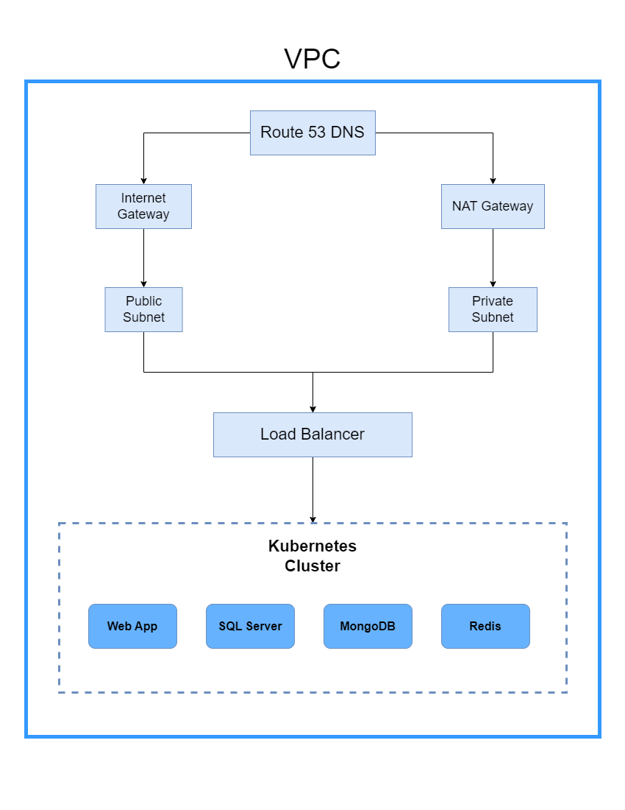

# Infrastructure Provisioning with Terraform

This repository contains Terraform templates to provision infrastructure for a web application and its associated databases (MongoDB, SQL Server), Redis for caching, a domain name, SSL certificate, and load balancer. The infrastructure is provisioned using Docker and Kubernetes.

## Architecture Diagram



## Components

- **VPC**: Virtual Private Cloud to host all infrastructure components.
- **Public Subnets**: Subnets that allow public access to resources like the Load Balancer.
- **Private Subnets**: Subnets for internal resources like databases.
- **Internet Gateway**: Enables access to the internet for public subnets.
- **NAT Gateway**: Allows private subnets to communicate with the internet without being directly exposed.
- **Load Balancer**: Distributes incoming traffic across multiple instances of the web application.
- **EKS Cluster**: Kubernetes cluster to manage containerized applications.
- **Node Groups (ASG)**: Auto Scaling Groups for the worker nodes in the EKS cluster.
- **Databases**: MongoDB, SQL Server, and Redis instances.
- **Route53 DNS**: Manages domain names and routes traffic to the Load Balancer.

## Directory Structure

```plaintext
terraform/
├── main.tf
├── variables.tf
├── outputs.tf
├── kubernetes/
│   ├── main.tf
│   ├── variables.tf
│   ├── outputs.tf
├── networking/
│   ├── main.tf
│   ├── variables.tf
│   ├── outputs.tf
│   ├── dns.tf
│   ├── ssl.tf
│   ├── load_balancer.tf
│   ├── security_groups.tf
├── databases/
│   ├── mongodb.tf
│   ├── sqlserver.tf
│   ├── redis.tf
├── application/
│   ├── deployment.tf
│   ├── service.tf
└── architecture.png
```
